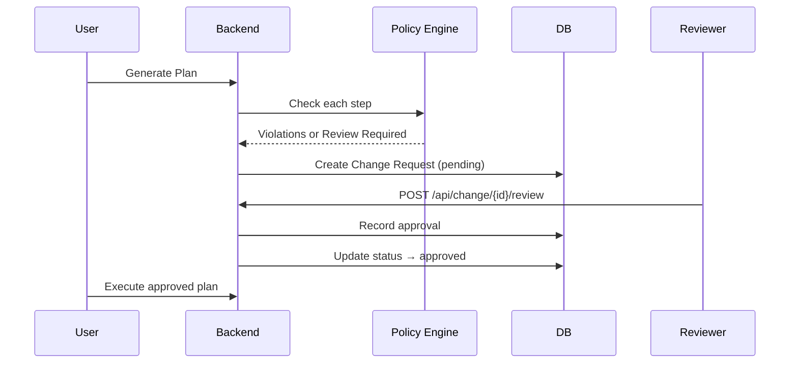

# 🧠 Autonomous Engineering Intelligence Platform
> *The AI-Powered Digital Coworker for Software Engineering Teams*

---

## 🚀 Vision

Transform how engineering teams work by providing an **autonomous AI assistant** that:
- **Understands** your entire codebase, tickets, and team context
- **Participates** in meetings and discussions like a team member
- **Codes autonomously** under supervision - plans, writes, tests, commits
- **Remembers everything** - decisions, patterns, and team knowledge
- **Integrates seamlessly** with your existing workflow (JIRA, GitHub, IDE)

---

## 💡 Key Capabilities

### 🤖 **Autonomous Coding**
- Plans implementation approaches based on requirements
- Writes code following team patterns and standards
- Runs tests and fixes issues automatically
- Creates PRs with detailed descriptions
- All under human supervision and approval

### 🧠 **Team Memory & Context**
- Persistent memory of all team decisions and discussions
- Understands codebase architecture and patterns
- Tracks project evolution and technical debt
- Provides context-aware suggestions and answers

### 🔗 **Workflow Integration**
- **JIRA**: Understands tickets, priorities, and sprint planning
- **GitHub**: Reviews PRs, understands code changes, manages issues
- **IDE**: Real-time assistance during development
- **Meetings**: Participates in standups, planning, and technical discussions

### 📊 **Intelligence & Analytics**
- Code quality insights and improvement suggestions
- Team productivity analytics and bottleneck identification
- Technical debt tracking and refactoring recommendations
- Knowledge gap analysis and documentation suggestions

---

## ⚙️ Quick Start

### Prerequisites
- Python 3.9+
- Node.js 16+
- PostgreSQL
- Redis (optional)

### Installation
\`\`\`bash
git clone <repository-url>
cd autonomous-engineering-platform

# Backend setup
cd backend
python -m venv .venv
source .venv/bin/activate
pip install -r requirements.txt

# Frontend setup
cd ../frontend
npm install

# Copy environment configuration
cp .env.template .env
\`\`\`

### Run Services
\`\`\`bash
# Start backend services
python -m backend.api.main        # Core API (port 8000)
python -m backend.api.realtime    # Realtime API (port 8001)

# Start frontend
cd frontend && npm start          # Web UI (port 3000)
\`\`\`

---

## 🧭 Development Roadmap

| Phase | Focus | Timeline |
|-------|-------|----------|
| **Phase 1** | Foundation - Core API, Memory Service, JIRA/GitHub Integration | Q1 2025 |
| **Phase 2** | AI Intelligence - Code Understanding, Context-Aware Q&A | Q2 2025 |
| **Phase 3** | Autonomous Coding - Code Generation, Testing, PR Creation | Q3 2025 |
| **Phase 4** | Team Intelligence - Analytics, Pattern Recognition | Q4 2025 |
| **Phase 5** | Enterprise - Multi-tenant, SSO, Global Deployment | 2026 |

---

## 📞 Contact

**Naga Durga Srinivas Nidamanuri**
- 📧 srinivasn7779@gmail.com
- 🔗 LinkedIn: [nnd-srinivas](https://www.linkedin.com/in/nnd-srinivas/)
- 💻 GitHub: [NNDSrinivas](https://github.com/NNDSrinivas)

---

## 🆕 PR-8: IDE Agent (VS Code)

### 🎯 **IDE-First Agent Architecture**

The **AEP Agent** provides intelligent coding assistance directly in VS Code with a **shared core** that enables future IDE extensions. Features include:

- **Contextual Greeting**: Time-aware greetings with assigned JIRA tasks
- **Task Selection**: Pick JIRA tickets and fetch comprehensive context packs
- **Smart Planning**: AI-generated implementation plans with file edits, tests, and git operations
- **Ask-Before-Do**: Explicit consent for every file modification and terminal command
- **Policy Enforcement**: Deny-by-default security with `.aepolicy.json` configuration

### 🏗️ **Architecture**

```
├── agent-core/          # Shared TypeScript core for all IDEs
│   ├── src/protocol.ts  # JSON-RPC message types
│   ├── src/runtime.ts   # Agent logic (greet, context, planning)
│   ├── src/tools.ts     # File/terminal operations
│   ├── src/policy.ts    # Security policy enforcement
│   └── src/agentd.ts    # Local WebSocket daemon for future IDEs
├── extensions/vscode/   # VS Code extension
│   ├── src/extension.ts # Main activation and webview
│   └── .vscode/launch.json # F5 debug configuration
└── .aepolicy.json       # Root security policies
```

### 🚀 **Getting Started**

#### **Prerequisites**
- Node.js 18+
- VS Code ^1.84.0  
- Backend services running (core on 8002, realtime on 8001)

#### **Build & Install**

1. **Build Shared Core**
   ```bash
   cd agent-core
   npm install
   npm run build
   ```

2. **Build VS Code Extension**
   ```bash
   cd ../extensions/vscode
   npm install
   npm run build
   ```

#### **Launch Extension**

1. **Open VS Code** in the `extensions/vscode/` directory
2. **Press F5** to launch Extension Development Host
3. **Command Palette** → `AEP: Open Agent`

#### **Expected Workflow**

1. **Greeting** appears: "Good Morning/Afternoon/Evening... You have N tasks..."
2. **Pick a ticket** → Context Pack JSON renders → **Plan Proposed** with steps
3. **Approve & Run** → consent modal for each step → file edits and command execution
4. **Policy Protection**: Denied commands (e.g., `docker login`) are blocked

#### **Optional: Agent Daemon**

For future IDE integrations, start the local WebSocket daemon:

```bash
cd agent-core
npm run dev:agentd
# Listening on ws://127.0.0.1:8765
```

### 🛡️ **Security Policies**

Configure allowed operations in `.aepolicy.json`:

```json
{
  "allow": {
    "commands": ["pytest", "npm", "git"],
    "paths": ["src/**", "tests/**"]
  },
  "deny": { 
    "commands": ["docker login", "curl http://"] 
  }
}
```

### 📊 **Telemetry & Monitoring**

The platform includes comprehensive telemetry for LLM usage tracking and audit logging:

#### **Prometheus Metrics**

Metrics are exposed at `/metrics` endpoint:

- `aep_llm_calls_total{phase,model,status}` - Total LLM calls by phase, model, and status
- `aep_llm_tokens_total{phase,model}` - Total tokens used by LLM calls  
- `aep_llm_cost_usd_total{phase,model}` - Total USD cost of LLM calls
- `aep_llm_latency_ms_bucket{phase,model,le}` - LLM call latency histogram

Example metrics query:
```bash
curl http://localhost:8002/metrics | grep aep_llm
```

#### **Audit Database**

All LLM calls are logged to the `llm_call` table with:

- **Metadata**: phase, model, status, created_at
- **Performance**: tokens, cost_usd, latency_ms  
- **Security**: prompt_hash (no raw prompts stored)
- **Context**: org_id, user_id for multi-tenant support
- **Errors**: error_message for failed calls

#### **Privacy & Security**

- Only telemetry metadata is persisted
- Prompts and context are **hashed** (SHA256) for audit trails
- No raw code or sensitive data is stored
- Error messages are sanitized in user-facing responses

#### **Usage Monitoring**

Test telemetry with the smoke test:
```bash
./scripts/smoke.sh
```

This generates sample plans and verifies metrics are being recorded correctly.

### 🧪 **Testing**

1. **Start Backend Services**
   ```bash
   # Terminal 1: Core API
   python -m uvicorn backend.api.main:app --port 8002 --reload
   
   # Terminal 2: Realtime API  
   python -m uvicorn backend.realtime.main:app --port 8001 --reload
   ```

2. **Launch Extension** (F5 in VS Code)
3. **Test Flow**: Command Palette → "AEP: Open Agent" → Pick task → Approve plan
4. **Verify Policy**: Try denied command to confirm security enforcement

### 🔮 **Future Roadmap**

- **PR-9**: Model Router & LLM-powered Planning with cost controls
- **PR-10**: Confluence/Slack integration for enriched context
- **PR-11**: Automated PR creation with JIRA comments  
- **PR-12**: JetBrains adapter using `agent-core` WebSocket protocol
- **PR-13**: Org Policy & Change Review (RBAC, Guardrails, Approvals) ✅
- **PR-14**: Context Intelligence Dashboard + Memory Search ✅

---

## 🔐 **PR-13 — Organization Policy & Change Review (RBAC + Guardrails)**

Enterprise-grade access control, policy enforcement, and approval workflows for autonomous coding operations.

### **Overview**

PR-13 adds organization-level RBAC (Role-Based Access Control), a policy engine for guardrails, and mandatory review workflows that gate risky actions before execution. This provides enterprise teams with fine-grained control over:

- **Who** can perform which actions (RBAC roles)
- **What** models, commands, paths, repos, and branches are allowed (Policy Engine)
- **When** human approval is required before execution (Change Review Workflow)

### **Architecture**

```
┌─────────────┐     ┌──────────────┐     ┌────────────────┐
│   IDE/UI    │────▶│ Policy Check │────▶│ Change Request │
│  Extension  │     │    Engine    │     │   (if needed)  │
└─────────────┘     └──────────────┘     └────────────────┘
                            │                      │
                            ▼                      ▼
                    ┌───────────────┐     ┌──────────────┐
                    │  Org Policy   │     │   Reviewers  │
                    │   Database    │     │ (approve/rej)│
                    └───────────────┘     └──────────────┘
```

### **RBAC Roles**

Four hierarchical roles with distinct permissions:

| Role | Permissions | Use Case |
|------|-------------|----------|
| **admin** | Full control: manage policy, users, approve changes | Platform administrators |
| **maintainer** | Review and approve changes, manage some policy | Tech leads, senior engineers |
| **developer** | Submit changes, execute approved plans | Team developers |
| **viewer** | Read-only access to plans and changes | Stakeholders, auditors |

### **Policy Engine**

Central `org_policy` table controls:

#### **Model Controls**
```json
{
  "models_allow": ["gpt-4o", "claude-3-5-sonnet", "gpt-4-turbo"],
  "phase_budgets": {
    "plan": {"tokens": 150000, "usd_per_day": 5.00},
    "code": {"tokens": 200000, "usd_per_day": 8.00},
    "review": {"tokens": 80000, "usd_per_day": 2.00}
  }
}
```

#### **Command Controls**
```json
{
  "commands_allow": ["pytest", "npm", "git", "grep", "find"],
  "commands_deny": ["docker login", "curl http://", "rm -rf", "sudo"]
}
```

#### **Path & Repository Controls**
```json
{
  "paths_allow": ["backend/**", "frontend/**", "src/**", "tests/**"],
  "repos_allow": ["myorg/myrepo", "myorg/another-repo"],
  "branches_protected": ["main", "master", "release/*"]
}
```

#### **Review Requirements**
```json
{
  "required_reviewers": 1,
  "require_review_for": ["git", "pr", "jira"]
}
```

### **Change Review Workflow**

1. **Plan Generation**: Agent generates execution plan with proposed steps
2. **Policy Check**: Each step validated against org policy
3. **Submit for Review**: If review required, creates `change_request` with status `pending`
4. **Approval Process**: Maintainers/admins review and approve/reject
5. **Execution**: Once approved (`required_reviewers` met), agent executes with ask-before-do flow



### **API Endpoints**

#### **Policy Management**

```bash
# Get current org policy
GET /api/policy
Headers: X-Org-Id: default

# Update org policy (admin/maintainer only)
POST /api/policy
Headers: X-Org-Id: default, X-User-Id: admin1
Body: {
  "models_allow": ["gpt-4o"],
  "commands_deny": ["sudo", "docker login"],
  "required_reviewers": 2
}

# Check if action is allowed
GET /api/policy/check?kind=cmd&command=pytest
Headers: X-Org-Id: default
```

#### **Change Requests**

```bash
# Submit change request
POST /api/change/request
Headers: X-Org-Id: default, X-User-Id: dev1
Body: {
  "title": "Implement user authentication",
  "ticket_key": "PROJ-123",
  "plan": {
    "items": [
      {"kind": "edit", "files": ["auth.py"]},
      {"kind": "cmd", "command": "pytest tests/"},
      {"kind": "git", "branch": "main"}
    ]
  }
}

# Response:
{
  "accepted": true,
  "change_id": 42,
  "status": "pending",  # or "approved" if no review needed
  "needs_review": true
}

# Get change request details
GET /api/change/42
Headers: X-Org-Id: default

# Review change request (maintainer/admin only)
POST /api/change/42/review
Headers: X-Org-Id: default, X-User-Id: lead1
Body: {
  "decision": "approve",  # or "reject"
  "comment": "LGTM, proceed with implementation"
}

# List change requests
GET /api/change?status=pending&limit=50
Headers: X-Org-Id: default
```

### **Database Schema**

```sql
-- Organizations
CREATE TABLE org (
    id VARCHAR(64) PRIMARY KEY,
    name VARCHAR(128) NOT NULL
);

-- User-Organization membership with roles
CREATE TABLE org_user (
    id SERIAL PRIMARY KEY,
    org_id VARCHAR(64) REFERENCES org(id),
    user_id VARCHAR(64) NOT NULL,
    role VARCHAR(16) NOT NULL  -- admin|maintainer|developer|viewer
);

-- Organization policies
CREATE TABLE org_policy (
    org_id VARCHAR(64) PRIMARY KEY REFERENCES org(id),
    models_allow TEXT,           -- JSON array
    phase_budgets TEXT,          -- JSON object
    commands_allow TEXT,         -- JSON array
    commands_deny TEXT,          -- JSON array
    paths_allow TEXT,            -- JSON array (globs)
    repos_allow TEXT,            -- JSON array
    branches_protected TEXT,     -- JSON array
    required_reviewers INTEGER DEFAULT 1,
    require_review_for TEXT      -- JSON array
);

-- Change requests submitted for approval
CREATE TABLE change_request (
    id SERIAL PRIMARY KEY,
    org_id VARCHAR(64) REFERENCES org(id),
    user_id VARCHAR(64) NOT NULL,
    ticket_key VARCHAR(64),
    title VARCHAR(256),
    plan_json TEXT NOT NULL,
    patch_summary TEXT,
    status VARCHAR(16) DEFAULT 'pending',  -- pending|approved|rejected
    created_at TIMESTAMP WITH TIME ZONE DEFAULT CURRENT_TIMESTAMP
);

-- Reviews for change requests
CREATE TABLE change_review (
    id SERIAL PRIMARY KEY,
    change_id INTEGER REFERENCES change_request(id) ON DELETE CASCADE,
    reviewer_id VARCHAR(64) NOT NULL,
    decision VARCHAR(16) NOT NULL,  -- approve|reject
    comment TEXT,
    created_at TIMESTAMP WITH TIME ZONE DEFAULT CURRENT_TIMESTAMP
);
```

### **Telemetry & Metrics**

New Prometheus metrics for policy enforcement:

```python
# Policy checks
aep_policy_checks_total{result="allow|deny", kind="edit|cmd|git|pr|jira", org_id}

# Change requests
aep_change_requests_total{status="pending|approved|rejected", org_id}

# Change reviews  
aep_change_reviews_total{decision="approve|reject", org_id}

# Budget violations
aep_budget_violations_total{phase="plan|code|review", limit_type="tokens|usd", org_id}
```

### **Setup & Configuration**

1. **Run Migration**
   ```bash
   make migrate  # Applies 0008_org_policy_rbac_approvals
   ```

2. **Seed Default Policy**
   ```bash
   make seed-policy  # Creates 'default' org with sample users and policy
   ```

3. **Verify Setup**
   ```bash
   # Check policy loaded
   curl http://localhost:8002/api/policy \
     -H "X-Org-Id: default"
   
   # Test policy check
   curl "http://localhost:8002/api/policy/check?kind=cmd&command=sudo" \
     -H "X-Org-Id: default"
   # Should return: {"allowed": false, "reasons": ["command denied: sudo"]}
   ```

### **IDE Integration**

Extensions (VS Code, JetBrains) now surface:

1. **Submit for Review** button after plan generation
2. **Policy Violations** displayed inline if action denied
3. **Approval Status** tracking for pending change requests
4. **Execute Approved Plan** button appears when CR approved

Users still retain **ask-before-do** confirmation dialogs during execution, but the policy layer adds organization-wide guardrails and approval gates before reaching that point.

### **Security Best Practices**

✅ **Least Privilege**: Start developers with minimal permissions, expand as needed  
✅ **Protected Branches**: Always include `main`, `master`, `production` in `branches_protected`  
✅ **Command Deny List**: Block `sudo`, `docker login`, `curl http://`, `wget`, `rm -rf`  
✅ **Budget Limits**: Set daily token and cost caps per phase to prevent runaway usage  
✅ **Audit Trail**: All policy checks and reviews logged to `audit_log` table  
✅ **Required Reviews**: Mandate approval for sensitive actions (`git`, `pr`, `jira`)

### **Testing**

```bash
# 1. Seed policy
make seed-policy

# 2. Test policy endpoint
curl http://localhost:8002/api/policy -H "X-Org-Id: default"

# 3. Submit test change request
curl -X POST http://localhost:8002/api/change/request \
  -H "Content-Type: application/json" \
  -H "X-Org-Id: default" \
  -H "X-User-Id: dev1" \
  -d '{
    "title": "Test change",
    "plan": {
      "items": [
        {"kind": "git", "branch": "main", "repo": "myorg/myrepo"}
      ]
    }
  }'

# 4. Review as maintainer
curl -X POST http://localhost:8002/api/change/1/review \
  -H "Content-Type: application/json" \
  -H "X-Org-Id: default" \
  -H "X-User-Id: lead1" \
  -d '{"decision": "approve", "comment": "Approved for testing"}'

# 5. Verify metrics
curl http://localhost:8002/metrics | grep aep_policy
curl http://localhost:8002/metrics | grep aep_change
```

### **Acceptance Criteria**

✅ Migration creates all tables with proper indexes and foreign keys  
✅ `GET /api/policy` returns current org policy configuration  
✅ `POST /api/policy` requires admin/maintainer role  
✅ Policy violations block change requests with detailed reasons  
✅ Change requests requiring review start in `pending` status  
✅ Maintainers/admins can approve/reject changes  
✅ Approval count threshold triggers status → `approved`  
✅ All operations logged to `audit_log` table  
✅ Prometheus metrics increment correctly  
✅ Seed script creates default org, users, and sensible policy


---

## 🧠 **PR-14 — Context Intelligence Dashboard + Memory Search**

**Status:** ✅ Complete  
**Branch:** `feat/pr-14-memory-search`

### Overview

PR-14 adds a **semantic memory search system** that indexes and retrieves content from:
- **JIRA issues** (summaries, descriptions, status)
- **Meeting summaries** (action items, decisions, transcripts)
- **GitHub code** (file content from indexed repositories)

A lightweight **Next.js dashboard** provides a unified search interface with citations, scores, and direct links to source content.

### Architecture

```
┌──────────────┐     ┌──────────────┐     ┌──────────────┐
│ JIRA Issues  │────▶│              │     │              │
│ Meeting Data │────▶│   Indexer    │────▶│ memory_chunk │
│ GitHub Files │────▶│              │     │  (embeddings)│
└──────────────┘     └──────────────┘     └──────────────┘
                              │
                              ▼
                     ┌──────────────┐
                     │   Retriever  │
                     │  (cosine sim)│
                     └──────────────┘
                              │
                              ▼
                     ┌──────────────┐
                     │ /api/search  │◀──── Next.js UI
                     └──────────────┘
```

### Database Schema

**Tables:**
- `memory_object` - Source content metadata (JIRA key, meeting ID, file path)
- `memory_chunk` - Text chunks with embeddings for semantic search

**Migration:** `alembic/versions/0009_memory_search.py`

### API Endpoints

#### `POST /api/search/`
Semantic search across all indexed content.

**Request:**
```json
{
  "q": "jwt token expiry handling",
  "k": 8
}
```

**Response:**
```json
{
  "hits": [
    {
      "score": 0.8234,
      "source": "jira",
      "title": "Fix JWT refresh token rotation",
      "foreign_id": "PROJ-123",
      "url": "https://your-jira.atlassian.net/browse/PROJ-123",
      "meta": {"status": "In Progress"},
      "chunk_seq": 0,
      "excerpt": "Implement JWT token refresh rotation to prevent..."
    },
    {
      "score": 0.7891,
      "source": "code",
      "title": "auth/jwt.py",
      "foreign_id": "org/repo::auth/jwt.py",
      "url": "https://github.com/org/repo/blob/HEAD/auth/jwt.py",
      "meta": {"repo": "org/repo", "path": "auth/jwt.py"},
      "chunk_seq": 2,
      "excerpt": "def refresh_token(token: str) -> str:\\n    ..."
    }
  ]
}
```

#### `POST /api/search/reindex/jira`
Reindex all JIRA issues (limit: 2000 most recent).

#### `POST /api/search/reindex/meetings`
Reindex meetings and summaries (limit: 1000 most recent).

#### `POST /api/search/reindex/code`
Reindex GitHub code files (limit: 5000 most recent).

### Embeddings Configuration

Set via environment variables:

```bash
# Embedding provider (default: openai)
EMBED_PROVIDER=openai

# OpenAI embedding model (default: text-embedding-3-small)
OPENAI_EMBED_MODEL=text-embedding-3-small

# Vector dimensions (default: 1536 for OpenAI)
EMBED_DIM=1536

# OpenAI API key (required for openai provider)
OPENAI_API_KEY=sk-...
```

**Dev Fallback:** If `OPENAI_API_KEY` is not set, a simple fallback embedder is used (returns sparse vectors based on text length).

### Web Dashboard

**Tech Stack:** Next.js 14, TypeScript, React 18

**Features:**
- **Overview** page (`/`) - Introduction and stats
- **Memory Search** page (`/search`) - Query interface with live results
- Citation cards showing source, score, excerpt, and links

**Run Locally:**
```bash
# Install dependencies and start dev server
make web-dev

# Open http://localhost:3030
```

**Configuration:**
Copy `web/.env.local.example` to `web/.env.local`:
```
NEXT_PUBLIC_AEP_CORE=http://localhost:8002
```

### Setup & Usage

1. **Run Migration**
   ```bash
   make migrate  # Applies 0009_memory_search
   ```

2. **Start Core API**
   ```bash
   make dev  # Backend runs at :8002
   ```

3. **Reindex Content**
   ```bash
   make reindex  # Populates memory from JIRA/Meetings/GitHub
   ```
   
   Or manually:
   ```bash
   curl -X POST "http://localhost:8002/api/search/reindex/jira" \
     -H "X-Org-Id: default"
   
   curl -X POST "http://localhost:8002/api/search/reindex/meetings" \
     -H "X-Org-Id: default"
   
   curl -X POST "http://localhost:8002/api/search/reindex/code" \
     -H "X-Org-Id: default"
   ```

4. **Start Dashboard**
   ```bash
   make web-dev  # Next.js runs at :3030
   ```

5. **Search**
   - Open http://localhost:3030/search
   - Enter query: "authentication bugs", "meeting decisions on API rate limits", etc.
   - View results with scores, sources, and links

### Smoke Test

```bash
# 1. Index sample content
make reindex

# 2. Test semantic search API
curl -X POST "http://localhost:8002/api/search/" \
  -H "Content-Type: application/json" \
  -H "X-Org-Id: default" \
  -d '{"q": "jwt expiry", "k": 5}'

# 3. Open dashboard
make web-dev
# Visit http://localhost:3030/search
```

### Performance & Limits

- **Chunk size:** 1200 chars with 150 char overlap
- **Max chunks scanned:** 6000 per query (adjust in `retriever.py` if needed)
- **Reindex limits:**
  - JIRA: 2000 most recent issues
  - Meetings: 1000 most recent
  - Code: 5000 most recent files
  
For production deployments:
- Use a vector database (Pinecone, Weaviate, pgvector) for >10k chunks
- Implement incremental indexing on JIRA/GitHub webhooks
- Add background workers for async reindexing

### Acceptance Criteria

✅ `memory_object` and `memory_chunk` tables created  
✅ `/api/search` returns top-k results with citations  
✅ Reindex endpoints populate embeddings from JIRA/Meetings/Code  
✅ Next.js dashboard runs locally at :3030  
✅ Search interface displays source, title, excerpt, and Open link  
✅ Works with SQLite and PostgreSQL  
✅ Embeddings provider configurable via env vars  
✅ All API calls audited and rate-limited (existing middleware)

### Roadmap: PR-14B

**Coming next:** Connector integrations for:
- **Slack** - Index messages, threads, pins
- **Confluence** - Index wiki pages, attachments
- **Microsoft Teams** - Index chat, files
- **Zoom** - Index transcripts, recordings

Stay tuned for **PR-14B** to expand memory coverage!

