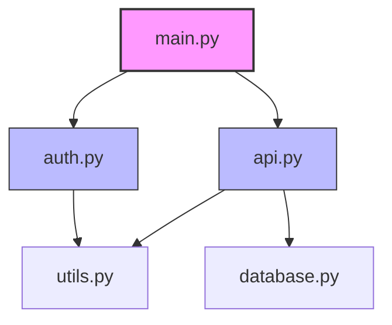

# 🚀 NAVI Core Capabilities Implementation Plan

> **Goal**: Make NAVI a powerful autonomous coding agent that can think, analyze, and implement end-to-end without third-party integrations

**Target Timeline**: 3-4 weeks
**Focus**: Core intelligence, not enterprise integrations

---

## 📊 Current Status Assessment

### ✅ Phase 1: Basic Autonomous Coding (COMPLETE)
- [x] File operations (create/modify/delete)
- [x] User approval workflow with UI
- [x] Git safety and rollback
- [x] Syntax validation
- [x] Secret detection
- [x] Step-by-step execution

**Files**:
- `backend/autonomous/enhanced_coding_engine.py` (1500+ lines)
- `extensions/vscode-aep/webview/src/components/AutonomousStepApproval.tsx`
- `backend/api/routers/autonomous_coding.py`

---

## 🎯 Phase 2: Intelligent Code Understanding (Week 1-2)

### Goal
Enable NAVI to understand project structure, dependencies, and patterns so it can "think for itself"

### Features to Implement

#### 2.1 Codebase Indexing System
**What**: Index entire workspace with file relationships and metadata

**Implementation**:
```python
# File: backend/agent/codebase_indexer.py (NEW)

class CodebaseIndexer:
    """Index and understand project structure"""

    async def index_workspace(self, workspace_path: str) -> ProjectIndex:
        """
        Scan workspace and build project index:
        - File tree structure
        - Programming languages detected
        - Entry points (main.py, index.js, etc.)
        - Config files (package.json, requirements.txt, etc.)
        - Test directories
        - Documentation
        """
        pass

    async def detect_project_type(self, files: List[str]) -> ProjectType:
        """Detect: Python/Node/React/Django/FastAPI/etc."""
        pass

    async def find_related_files(self, file_path: str) -> List[str]:
        """Find files that import or are imported by this file"""
        pass
```

**Database Schema**:
```sql
-- Store indexed codebase metadata
CREATE TABLE project_index (
    workspace_id VARCHAR(64) PRIMARY KEY,
    project_type VARCHAR(32),
    entry_points JSON,
    dependencies JSON,
    file_tree JSON,
    last_indexed TIMESTAMP
);

CREATE TABLE file_metadata (
    file_path VARCHAR(512) PRIMARY KEY,
    workspace_id VARCHAR(64),
    language VARCHAR(32),
    imports JSON,
    exports JSON,
    functions JSON,
    classes JSON,
    complexity_score FLOAT,
    last_modified TIMESTAMP
);
```

**Priority**: 🔥 CRITICAL
**Timeline**: 2-3 days
**Impact**: Foundation for all intelligent features

---

#### 2.2 AST-Based Code Analysis
**What**: Parse code into Abstract Syntax Trees to understand structure

**Implementation**:
```python
# File: backend/agent/ast_analyzer.py (NEW)

class ASTCodeAnalyzer:
    """Parse and analyze code structure"""

    def analyze_python(self, code: str) -> CodeAnalysis:
        """
        Parse Python code with ast module:
        - Functions and their signatures
        - Classes and methods
        - Imports and dependencies
        - Docstrings and comments
        - Complexity metrics
        """
        import ast
        tree = ast.parse(code)
        # Extract functions, classes, imports
        pass

    def analyze_typescript(self, code: str) -> CodeAnalysis:
        """Use TypeScript compiler API or tree-sitter"""
        pass

    def extract_function_signatures(self, tree: ast.AST) -> List[Function]:
        """Get all function definitions with params and return types"""
        pass

    def calculate_complexity(self, tree: ast.AST) -> float:
        """McCabe complexity score"""
        pass
```

**Dependencies to Add**:
- `ast` (built-in Python)
- `tree-sitter` (for multi-language parsing)
- `tree-sitter-python`, `tree-sitter-typescript`, `tree-sitter-javascript`

**Priority**: 🔥 CRITICAL
**Timeline**: 3-4 days
**Impact**: Enables understanding code semantics

---

#### 2.3 Dependency Graph Generator
**What**: Map imports and relationships between files

**Implementation**:
```python
# File: backend/agent/dependency_graph.py (NEW)

class DependencyGraphBuilder:
    """Build and analyze dependency graphs"""

    async def build_graph(self, workspace_path: str) -> DependencyGraph:
        """
        Create directed graph of file dependencies:
        - Nodes: Files
        - Edges: Import relationships
        - Metadata: Types of imports (local, external, circular)
        """
        pass

    def detect_circular_dependencies(self, graph: DependencyGraph) -> List[Cycle]:
        """Find circular import chains"""
        pass

    def find_impact_radius(self, file_path: str, graph: DependencyGraph) -> Set[str]:
        """Find all files affected if this file changes"""
        pass

    def suggest_refactoring(self, graph: DependencyGraph) -> List[Suggestion]:
        """Identify overly complex dependencies"""
        pass
```

**Output Example**:
```json
{
  "graph": {
    "nodes": [
      {"id": "src/auth.py", "type": "module", "complexity": 12},
      {"id": "src/utils.py", "type": "module", "complexity": 5}
    ],
    "edges": [
      {"from": "src/auth.py", "to": "src/utils.py", "type": "import"}
    ]
  },
  "metrics": {
    "total_files": 45,
    "circular_deps": 2,
    "max_depth": 5
  }
}
```

**Priority**: 🔥 HIGH
**Timeline**: 2-3 days
**Impact**: Enables smart refactoring and impact analysis

---

#### 2.4 Project Pattern Detection
**What**: Learn from existing code to follow project conventions

**Implementation**:
```python
# File: backend/agent/pattern_detector.py (NEW)

class ProjectPatternDetector:
    """Detect and learn project patterns"""

    async def detect_patterns(self, workspace_path: str) -> ProjectPatterns:
        """
        Analyze existing code to find:
        - Naming conventions (camelCase, snake_case, etc.)
        - File organization (by feature, by type)
        - Import style (relative, absolute)
        - Code style (formatting, spacing)
        - Architecture patterns (MVC, layered, etc.)
        - Testing patterns (unit, integration locations)
        """
        pass

    def detect_naming_convention(self, files: List[str]) -> NamingStyle:
        """Determine project's naming convention"""
        # Analyze function/class/variable names
        pass

    def detect_architecture(self, file_tree: Dict) -> ArchitecturePattern:
        """Identify: Django, FastAPI, React, Express, etc."""
        pass

    def generate_style_guide(self, patterns: ProjectPatterns) -> StyleGuide:
        """Create style guide from detected patterns"""
        pass
```

**Priority**: 🔥 HIGH
**Timeline**: 2 days
**Impact**: NAVI generates code that matches project style

---

#### 2.5 Multi-File Context Awareness
**What**: Understand code across multiple files when making changes

**Implementation**:
```python
# File: backend/agent/context_builder.py (ENHANCE EXISTING)

class MultiFileContextBuilder:
    """Build context from multiple related files"""

    async def build_context_for_task(
        self,
        task_description: str,
        workspace_path: str,
        project_index: ProjectIndex
    ) -> TaskContext:
        """
        Given a task, find all relevant files:
        1. Parse task to understand requirements
        2. Search for related files (imports, similar names)
        3. Load and analyze relevant code
        4. Extract patterns and dependencies
        5. Build comprehensive context
        """

        # Example: "Add user authentication"
        # Should find: existing auth files, user models, API routes
        relevant_files = await self._find_relevant_files(task_description, project_index)

        context = TaskContext(
            task=task_description,
            relevant_files=relevant_files,
            imports=await self._extract_imports(relevant_files),
            patterns=await self._detect_patterns(relevant_files),
            dependencies=await self._get_dependencies(relevant_files)
        )

        return context
```

**Integration Point**:
```python
# File: backend/autonomous/enhanced_coding_engine.py

class EnhancedAutonomousCodingEngine:

    async def generate_implementation_plan(
        self,
        task_description: str,
        workspace_path: str
    ):
        # NEW: Build multi-file context BEFORE planning
        project_index = await self.indexer.index_workspace(workspace_path)
        context = await self.context_builder.build_context_for_task(
            task_description,
            workspace_path,
            project_index
        )

        # Use context to generate smarter plan
        plan = await self.llm_service.generate_plan_with_context(
            task_description,
            context
        )

        return plan
```

**Priority**: 🔥 CRITICAL
**Timeline**: 3-4 days
**Impact**: NAVI understands the full picture

---

## 🎯 Phase 3: End-to-End Task Completion (Week 2)

### Goal
Enable NAVI to complete complex multi-file implementations autonomously

### Features to Implement

#### 3.1 Multi-Step Complex Task Execution
**What**: Handle tasks requiring multiple coordinated file changes

**Enhancement**:
```python
# File: backend/autonomous/enhanced_coding_engine.py (ENHANCE)

async def execute_complex_task(self, task_description: str):
    """
    Execute multi-step task with intelligence:
    1. Understand requirements
    2. Find related files
    3. Generate coordinated plan
    4. Execute steps with dependency ordering
    5. Validate changes across files
    6. Run tests (if available)
    7. Commit with descriptive message
    """

    # NEW: Intelligent step ordering
    steps = await self._generate_steps_with_dependencies(task_description)
    ordered_steps = self._topological_sort(steps)  # Execute in correct order

    for step in ordered_steps:
        await self.execute_step(step)
        await self._validate_cross_file_consistency()  # NEW
```

**Priority**: 🔥 CRITICAL
**Timeline**: 3 days
**Impact**: Can handle real-world tasks

---

#### 3.2 Automatic Test Generation and Execution
**What**: Generate tests for code and run them

**Implementation**:
```python
# File: backend/agent/test_generator.py (NEW)

class TestGenerator:
    """Generate and execute tests"""

    async def generate_tests(self, file_path: str, code: str) -> str:
        """
        Generate unit tests for code:
        - Detect test framework (pytest, unittest, jest)
        - Generate test cases covering functions
        - Include edge cases and error handling
        """
        pass

    async def run_tests(self, test_file: str) -> TestResults:
        """Execute tests and return results"""
        # For Python: subprocess.run(['pytest', test_file])
        # For JS: subprocess.run(['npm', 'test', test_file])
        pass

    async def analyze_coverage(self, source_file: str) -> CoverageReport:
        """Check test coverage for source file"""
        pass
```

**Integration**:
```python
# In EnhancedAutonomousCodingEngine

async def execute_step(self, step: Step):
    # ... existing execution logic ...

    # NEW: Auto-generate and run tests
    if step.operation in ['create', 'modify']:
        test_file = await self.test_generator.generate_tests(
            step.file_path,
            step.content
        )
        test_results = await self.test_generator.run_tests(test_file)

        if test_results.failed > 0:
            # Ask user: continue or fix?
            pass
```

**Priority**: 🔥 HIGH
**Timeline**: 2-3 days
**Impact**: Ensures code quality

---

#### 3.3 Intelligent Error Handling and Recovery
**What**: Detect errors and fix them autonomously

**Implementation**:
```python
# File: backend/agent/error_handler.py (NEW)

class IntelligentErrorHandler:
    """Handle and fix errors autonomously"""

    async def detect_error(self, file_path: str) -> Optional[Error]:
        """
        Run static analysis and linters:
        - Python: pylint, flake8, mypy
        - JavaScript: eslint
        - TypeScript: tsc
        """
        pass

    async def suggest_fix(self, error: Error, context: CodeContext) -> Fix:
        """Use LLM to suggest fix for error"""
        pass

    async def apply_fix(self, fix: Fix) -> FixResult:
        """Apply fix and validate"""
        pass

    async def retry_with_fix(self, step: Step, error: Error):
        """Retry step with automatic fix"""
        fix = await self.suggest_fix(error, step.context)
        if fix.confidence > 0.8:
            await self.apply_fix(fix)
            return await self.execute_step(step)  # Retry
```

**Priority**: 🔥 MEDIUM
**Timeline**: 2 days
**Impact**: Reduces manual intervention

---

## 🎯 Phase 4: Architecture Visualization (Week 3)

### Goal
Generate diagrams to explain code structure and architecture

### Features to Implement

#### 4.1 Architecture Diagram Generator
**What**: Generate visual diagrams of codebase structure

**Implementation**:
```python
# File: backend/agent/diagram_generator.py (NEW)

class ArchitectureDiagramGenerator:
    """Generate architecture diagrams"""

    async def generate_dependency_diagram(
        self,
        workspace_path: str
    ) -> DiagramOutput:
        """
        Generate dependency diagram using graphviz or mermaid:
        - Nodes: Modules/Files
        - Edges: Import relationships
        - Colors: By layer (API, service, data)
        """

        graph = await self.dependency_graph.build_graph(workspace_path)

        # Generate Mermaid syntax
        mermaid = self._to_mermaid(graph)

        # Or generate image
        image = self._to_image(graph)  # PNG/SVG

        return DiagramOutput(mermaid=mermaid, image=image)

    async def generate_class_diagram(self, files: List[str]) -> str:
        """Generate UML class diagram"""
        pass

    async def generate_sequence_diagram(self, entry_point: str) -> str:
        """Generate sequence diagram for code flow"""
        pass

    async def generate_layered_architecture(self, workspace: str) -> str:
        """Show layers: API -> Service -> Data"""
        pass
```

**Output Format (Mermaid)**:


**Priority**: 🔥 HIGH
**Timeline**: 3-4 days
**Impact**: Visual understanding for users

---

#### 4.2 Code Flow Visualization
**What**: Show how data/control flows through code

**Implementation**:
```python
class CodeFlowVisualizer:
    """Visualize code execution flow"""

    async def trace_function_calls(
        self,
        entry_function: str
    ) -> CallGraph:
        """Trace all function calls from entry point"""
        pass

    async def generate_flow_diagram(
        self,
        function_name: str
    ) -> str:
        """Generate flowchart for function logic"""
        # Parse function body
        # Extract conditions, loops, calls
        # Generate mermaid flowchart
        pass
```

**Priority**: 🔥 MEDIUM
**Timeline**: 2 days
**Impact**: Helps explain complex logic

---

## 🎯 Phase 5: Self-Learning and Improvement (Week 4)

### Goal
NAVI learns from its actions and improves over time

### Features to Implement

#### 5.1 Feedback Loop System
**What**: Learn from user approvals/rejections

**Implementation**:
```python
# File: backend/agent/learning_system.py (NEW)

class NAVILearningSystem:
    """Learn from user feedback"""

    async def record_feedback(
        self,
        task_id: str,
        step_id: str,
        approved: bool,
        user_comment: Optional[str]
    ):
        """Store user feedback in database"""
        pass

    async def learn_patterns(self):
        """
        Analyze feedback to learn:
        - What approaches work best
        - Common mistakes to avoid
        - Preferred coding styles
        - Successful patterns
        """
        pass

    async def improve_suggestions(self, task: str) -> ImprovedPlan:
        """Generate better plans using learned patterns"""
        pass
```

**Database Schema**:
```sql
CREATE TABLE navi_feedback (
    id SERIAL PRIMARY KEY,
    task_id VARCHAR(64),
    step_id VARCHAR(64),
    approved BOOLEAN,
    user_comment TEXT,
    task_description TEXT,
    generated_code TEXT,
    timestamp TIMESTAMP
);

CREATE TABLE learned_patterns (
    id SERIAL PRIMARY KEY,
    pattern_type VARCHAR(32),
    pattern_data JSON,
    success_rate FLOAT,
    usage_count INT,
    last_updated TIMESTAMP
);
```

**Priority**: 🔥 MEDIUM
**Timeline**: 2-3 days
**Impact**: NAVI gets smarter over time

---

#### 5.2 Performance Optimization
**What**: Learn which LLM strategies work best

**Implementation**:
```python
class PerformanceOptimizer:
    """Optimize NAVI performance"""

    async def track_metrics(self, task_execution: TaskExecution):
        """
        Track:
        - Time per step
        - Success rate
        - User approval rate
        - Error frequency
        """
        pass

    async def optimize_prompts(self, task_type: str) -> OptimizedPrompt:
        """Improve LLM prompts based on success patterns"""
        pass
```

**Priority**: 🔥 LOW
**Timeline**: 1-2 days
**Impact**: Better performance

---

## 📦 Dependencies to Add

### Python Libraries
```bash
pip install tree-sitter==0.20.4
pip install tree-sitter-python==0.20.4
pip install tree-sitter-typescript==0.20.3
pip install tree-sitter-javascript==0.20.3
pip install pygraphviz==1.11  # For diagram generation
pip install pylint==3.0.3  # Static analysis
pip install flake8==7.0.0
pip install mypy==1.8.0
```

### Node Libraries (for TS/JS analysis)
```bash
npm install @typescript-eslint/parser
npm install @typescript-eslint/typescript-estree
```

---

## 🗂️ File Structure

```
backend/
├── agent/
│   ├── codebase_indexer.py          # NEW - Phase 2.1
│   ├── ast_analyzer.py              # NEW - Phase 2.2
│   ├── dependency_graph.py          # NEW - Phase 2.3
│   ├── pattern_detector.py          # NEW - Phase 2.4
│   ├── context_builder.py           # ENHANCE - Phase 2.5
│   ├── test_generator.py            # NEW - Phase 3.2
│   ├── error_handler.py             # NEW - Phase 3.3
│   ├── diagram_generator.py         # NEW - Phase 4.1
│   ├── flow_visualizer.py           # NEW - Phase 4.2
│   └── learning_system.py           # NEW - Phase 5.1
│
├── autonomous/
│   └── enhanced_coding_engine.py    # ENHANCE - Phase 3.1
│
└── api/
    └── routers/
        └── autonomous_coding.py      # ENHANCE - Add diagram endpoints

alembic/versions/
└── 0019_navi_intelligence.py        # NEW - Database migrations
```

---

## 🎯 Success Metrics

### Phase 2 Success Criteria
- [ ] Can index 1000+ file workspace in <30 seconds
- [ ] Correctly identifies project type (Python/Node/React/etc.)
- [ ] Finds 90%+ of related files for a given task
- [ ] Detects project patterns (naming, architecture)
- [ ] Builds accurate dependency graph

### Phase 3 Success Criteria
- [ ] Completes multi-file tasks (3+ files) successfully
- [ ] Generates passing tests for 80%+ of code
- [ ] Auto-fixes 60%+ of linting errors
- [ ] Executes tasks 50% faster with intelligent ordering

### Phase 4 Success Criteria
- [ ] Generates readable architecture diagrams
- [ ] Correctly shows dependency relationships
- [ ] Visualizes code flow for complex functions
- [ ] Exports diagrams in multiple formats (PNG, SVG, Mermaid)

### Phase 5 Success Criteria
- [ ] Approval rate improves by 20% after 100 tasks
- [ ] Error rate decreases by 30% over time
- [ ] Generates code matching project style 90%+ of time

---

## 🚀 Implementation Order (Priority)

### Week 1 (Days 1-5)
**Focus**: Code Understanding
1. Day 1-2: Codebase indexer (Phase 2.1)
2. Day 3-4: AST analyzer (Phase 2.2)
3. Day 5: Dependency graph (Phase 2.3)

### Week 2 (Days 6-10)
**Focus**: Intelligence
1. Day 6-7: Pattern detection (Phase 2.4)
2. Day 8-9: Multi-file context (Phase 2.5)
3. Day 10: Integration testing

### Week 3 (Days 11-15)
**Focus**: Complex Tasks
1. Day 11-12: Multi-step execution (Phase 3.1)
2. Day 13-14: Test generation (Phase 3.2)
3. Day 15: Error handling (Phase 3.3)

### Week 4 (Days 16-20)
**Focus**: Visualization
1. Day 16-17: Diagram generator (Phase 4.1)
2. Day 18: Flow visualizer (Phase 4.2)
3. Day 19-20: Learning system (Phase 5.1) + Polish

---

## 📝 Testing Strategy

### Unit Tests
```python
# tests/test_codebase_indexer.py
def test_index_python_project():
    indexer = CodebaseIndexer()
    index = await indexer.index_workspace('./test_data/python_project')
    assert index.project_type == 'python'
    assert len(index.files) > 0
    assert 'main.py' in index.entry_points
```

### Integration Tests
```python
# tests/integration/test_autonomous_coding.py
async def test_complete_multi_file_task():
    """Test: 'Add REST API endpoint with validation'"""
    engine = EnhancedAutonomousCodingEngine()
    result = await engine.execute_task(
        "Add a REST API endpoint for user registration with validation"
    )

    # Should create/modify multiple files
    assert len(result.files_changed) >= 3
    # Should include tests
    assert any('test' in f for f in result.files_changed)
    # Tests should pass
    assert result.test_results.passed > 0
```

### End-to-End Tests
```python
# tests/e2e/test_navi_workflow.py
async def test_full_autonomous_workflow():
    """Test complete user workflow"""
    # 1. User sends request
    response = await client.post('/api/navi/chat', json={
        'message': 'Create a user authentication system'
    })

    # 2. NAVI generates plan
    assert response.json()['agentRun']['mode'] == 'autonomous_coding'
    task_id = response.json()['state']['task_id']

    # 3. Get steps
    steps = await client.get(f'/api/autonomous/tasks/{task_id}/steps')
    assert len(steps.json()['steps']) > 0

    # 4. Approve all steps
    for step in steps.json()['steps']:
        result = await client.post('/api/autonomous/execute-step', json={
            'task_id': task_id,
            'step_id': step['id'],
            'user_approved': True
        })
        assert result.json()['status'] == 'completed'

    # 5. Verify files created
    assert os.path.exists('workspace/auth.py')
    assert os.path.exists('workspace/tests/test_auth.py')
```

---

## 🎬 Demo Scenarios

### Scenario 1: Simple Feature
```
User: "Create a function to calculate fibonacci numbers with memoization"

NAVI:
1. Analyzes request
2. Creates fibonacci.py with optimized implementation
3. Generates tests
4. Runs tests
5. Commits with descriptive message

Result: ✅ Single file with tests, working code
```

### Scenario 2: Multi-File Feature
```
User: "Add a REST API endpoint for user registration with email validation"

NAVI:
1. Indexes codebase, finds API structure
2. Identifies: routes.py, models.py, validators.py
3. Generates plan:
   - Step 1: Add User model to models.py
   - Step 2: Create email validator in validators.py
   - Step 3: Add /register endpoint to routes.py
   - Step 4: Generate tests
4. Executes with dependency ordering
5. Runs tests, all pass
6. Commits with message

Result: ✅ Multi-file feature, fully tested
```

### Scenario 3: Architecture Explanation
```
User: "Show me the architecture of this project"

NAVI:
1. Indexes codebase
2. Analyzes dependencies
3. Generates diagram showing:
   - API layer
   - Service layer
   - Data layer
   - External dependencies
4. Shows Mermaid diagram in chat
5. Offers to export as PNG/SVG

Result: ✅ Visual architecture diagram
```

### Scenario 4: Bug Fix
```
User: "Fix the authentication bug where expired tokens aren't rejected"

NAVI:
1. Searches for auth-related code
2. Finds token validation logic
3. Identifies missing expiry check
4. Generates fix with proper validation
5. Updates tests to cover expiry
6. Runs tests, all pass
7. Commits fix

Result: ✅ Bug fixed with test coverage
```

---

## 📊 Resource Requirements

### Development Time
- **Phase 2**: 8-10 days (1 developer)
- **Phase 3**: 5-7 days (1 developer)
- **Phase 4**: 3-4 days (1 developer)
- **Phase 5**: 2-3 days (1 developer)

**Total**: ~3-4 weeks for 1 developer

### Infrastructure
- **Database**: PostgreSQL for project index
- **Compute**: Minimal, mostly CPU for AST parsing
- **Storage**: ~100MB per indexed workspace
- **LLM Costs**: Moderate increase for context-aware prompts

---

## ✅ Acceptance Criteria

NAVI will be considered "powerful" when it can:

1. **Understand Context** ✅
   - Index and understand project structure
   - Identify related files for a task
   - Follow project patterns and conventions

2. **Think for Itself** ✅
   - Generate intelligent multi-file plans
   - Detect errors and suggest fixes
   - Learn from feedback

3. **Complete End-to-End** ✅
   - Handle complex multi-file tasks
   - Generate and run tests
   - Commit with proper messages

4. **Explain Visually** ✅
   - Generate architecture diagrams
   - Show dependency relationships
   - Visualize code flow

5. **Self-Improve** ✅
   - Learn from approvals/rejections
   - Optimize performance over time
   - Adapt to project style

---

## 🚀 Next Action

**START NOW**: Phase 2.1 - Codebase Indexing System

Create `backend/agent/codebase_indexer.py` with basic workspace scanning and file tree generation.

Would you like me to implement the codebase indexer first?
