# NAVI UI Mockups

Open this file in VS Code and use the Markdown Preview to view images.

## Concept A - Clean SaaS

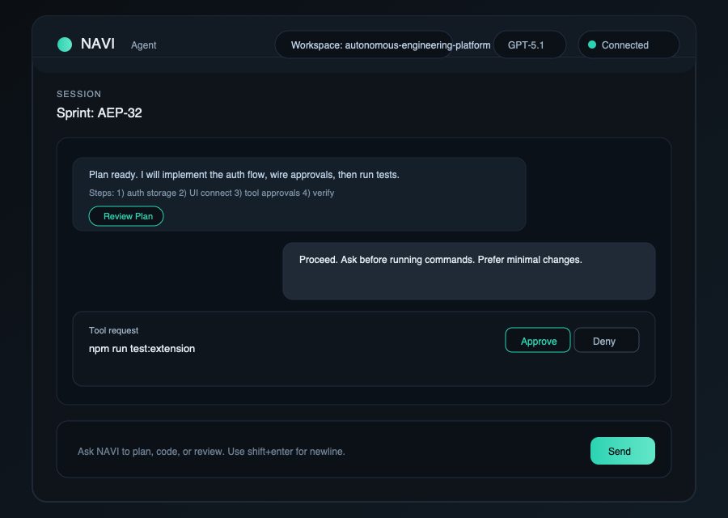

## Concept B - Agent Console

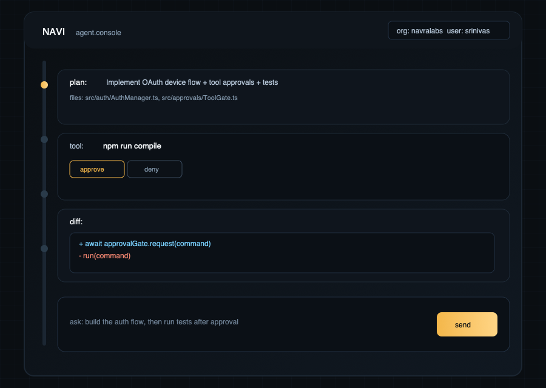

## Concept C - Split Chat + Plan

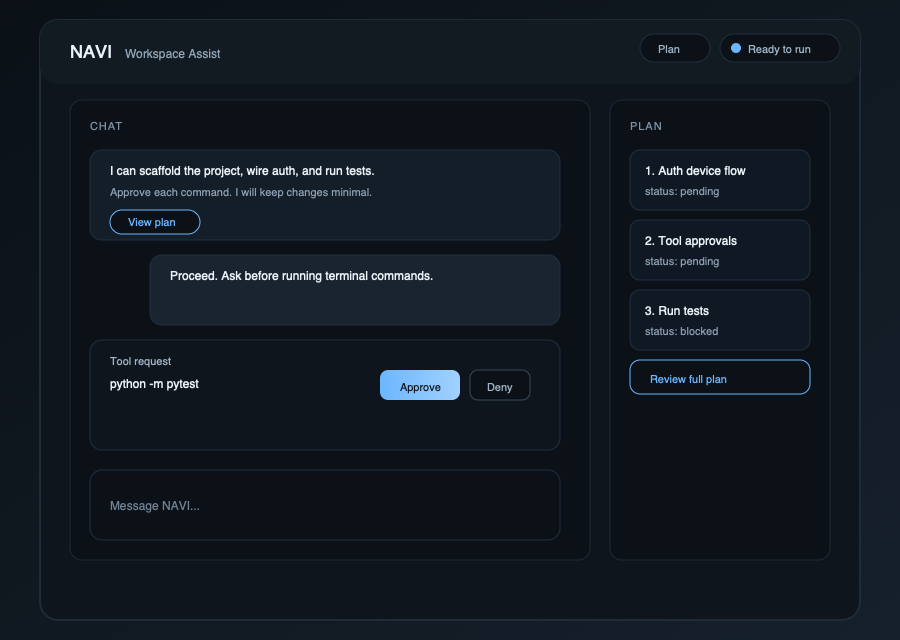

## Concept B - Full Scale (Enhanced)

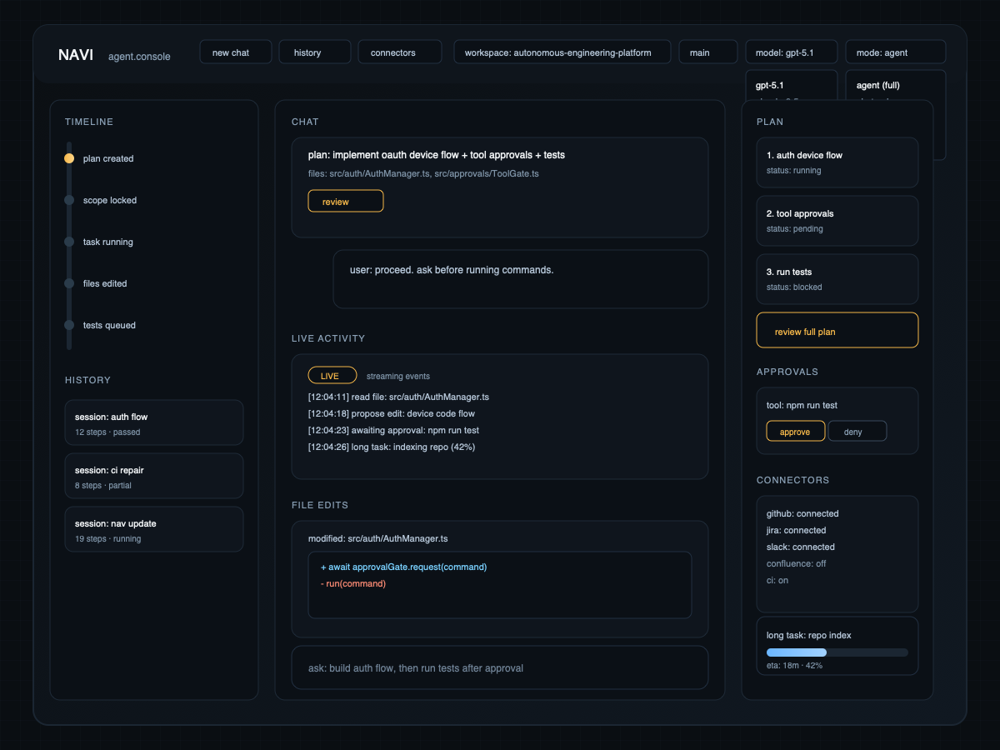

## Concept B - Running State (Enhanced)

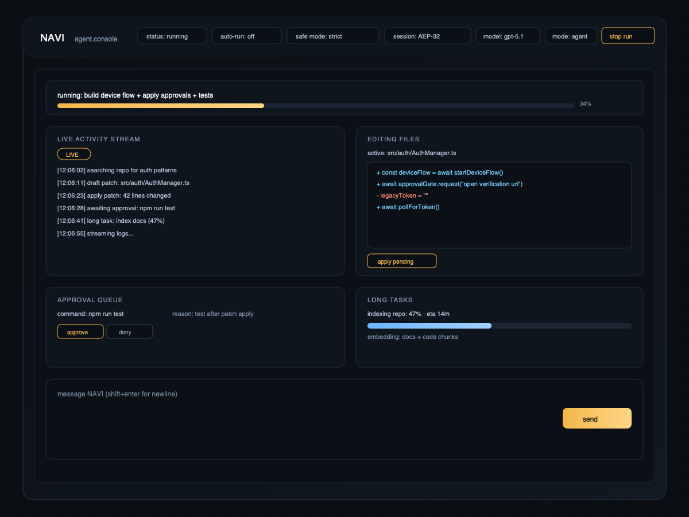

## Concept B - Minimal Header Icons

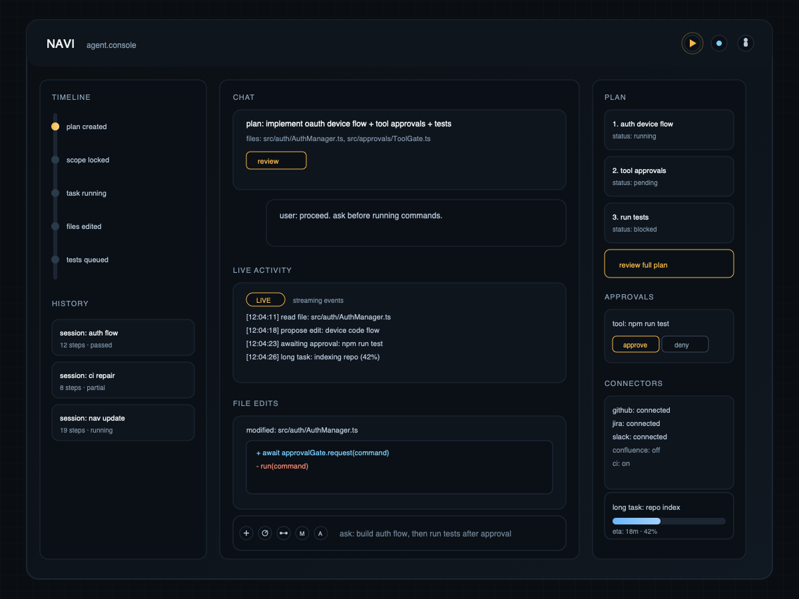

## Concept B - Minimal Header (Running)

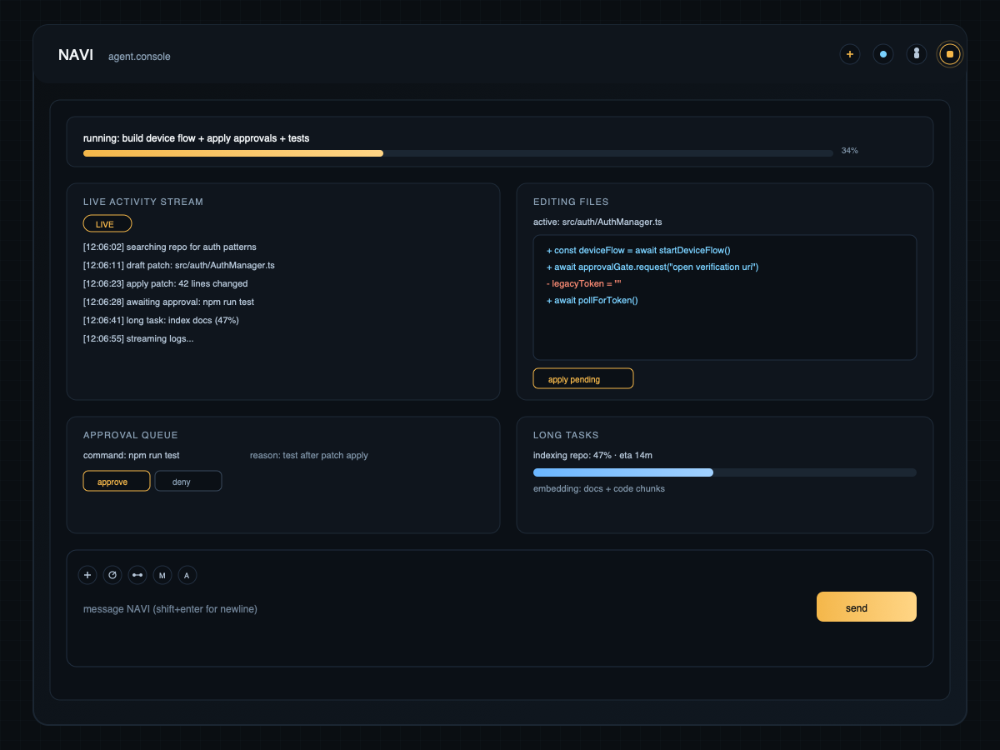

## Concept B2 - Single Column Minimal (Futuristic)

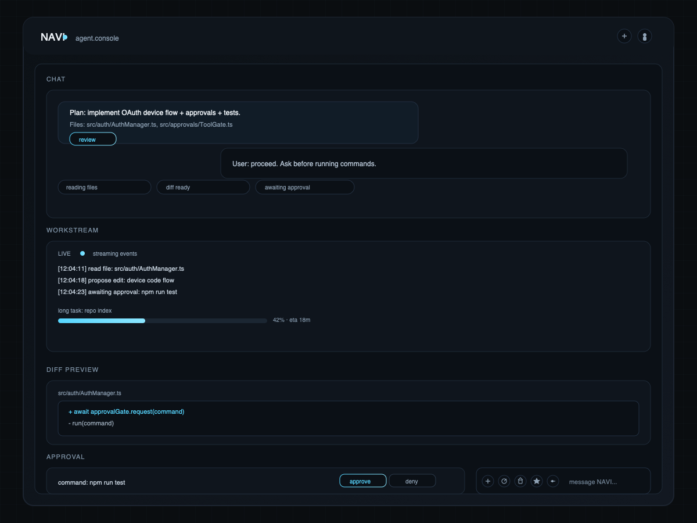

## Concept B2 - Single Column Minimal (Running)

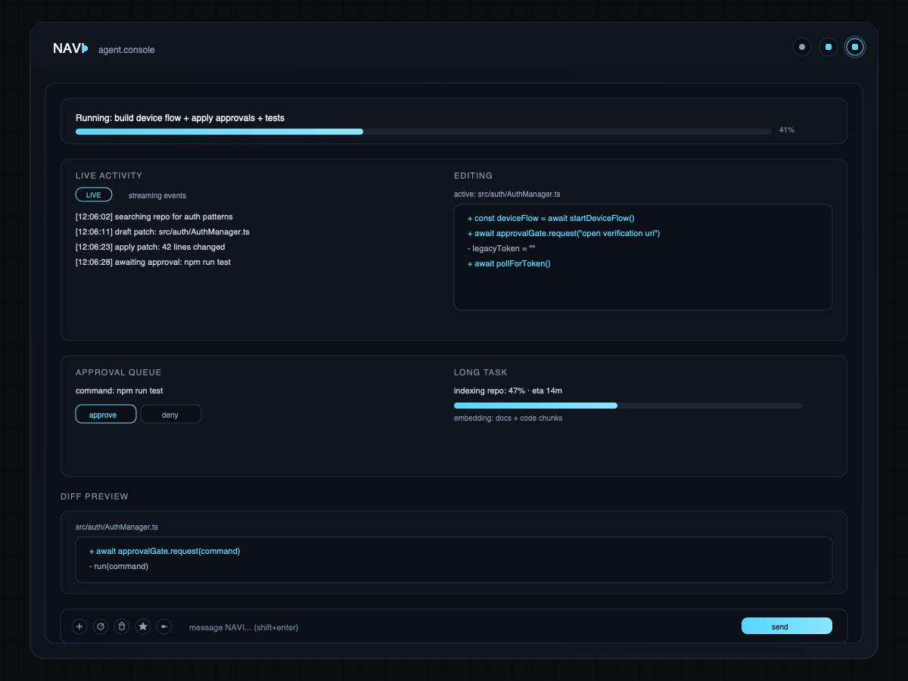

## Concept B3 - Code Companion Palette (Minimal, Single Column)

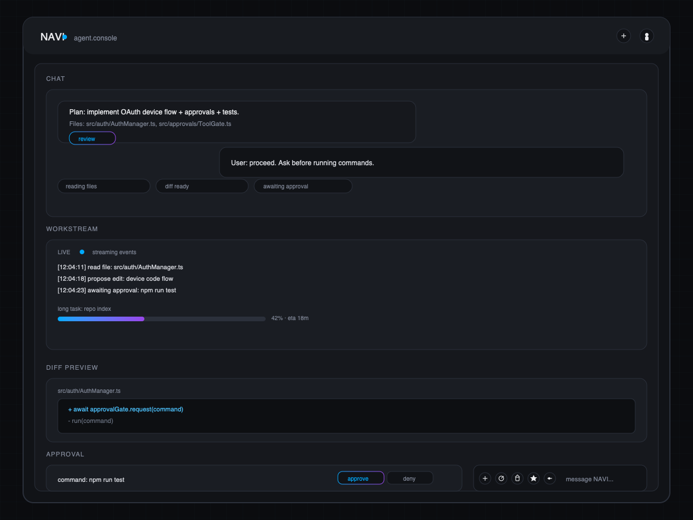

## Concept B3 - Code Companion Palette (Running)

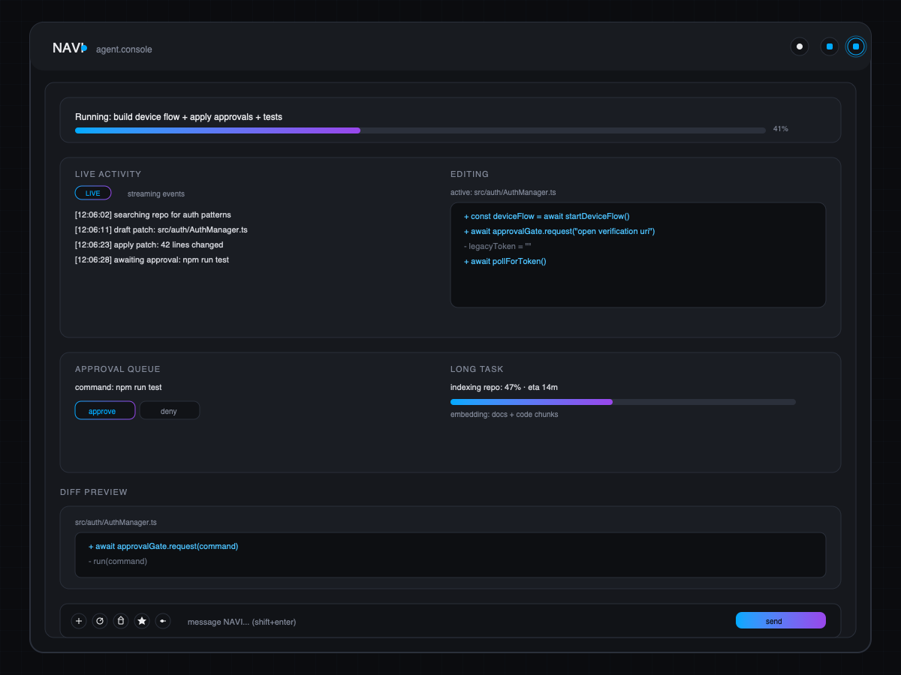

## Activity Pattern - Compact

## Activity Pattern - Log Expanded

## Activity Pattern - Log + Files Expanded

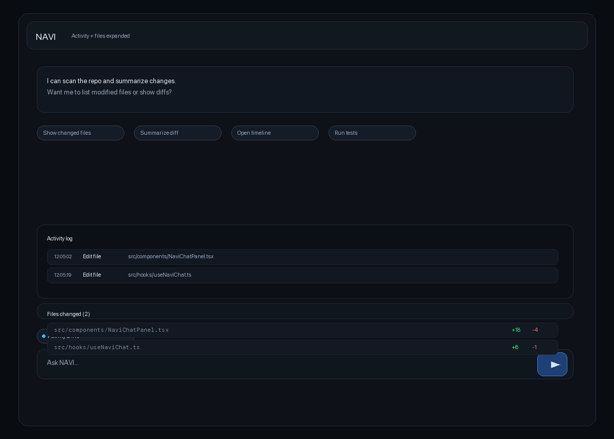
